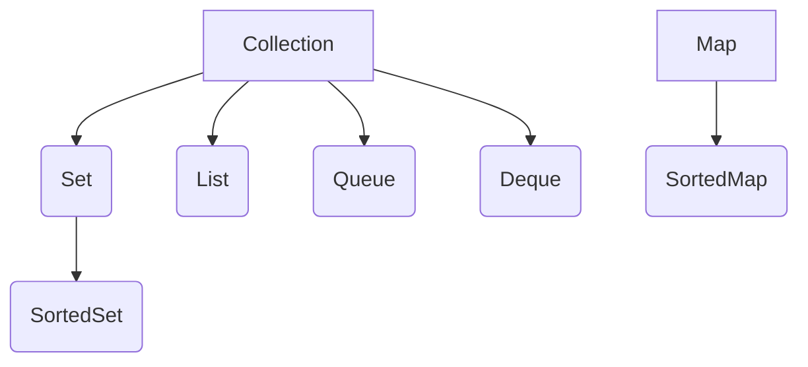

#### 1.Collection与Collections有什么区别

        了解集合，首先要区分Collection和Collections的区别，虽然两者都位于java.util包下，但是两者还是有根本的区别。
    
    Collection是集合框架的根(ROOT)接口，Set，List，Queue，Deque都继承自此接口。
    
    Collections是常用的集合工具类，提供了sort等方法。

#### 2.集合有哪些，他们又有什么区别

    集合框架涉及到的接口有Collection，Set，List，Queue，Deque，Map;
    


#### Collection

        Collection提供了丰富的数据结果，他们有的允许有重复的内容，有的不允许重复，有的是有序的，有的是无序的；Collection提供了基础的方法，例如常用的增加，删除等，也提供了批量新增，删除，containsAll等方法。
        
        遍历集合有三种方式：foreach循环，iterators迭代器，JDK1.8以后还新增了聚合操作兰姆达表达式。
        //方式1：
        for(Object o: list){
            System.out.println(o);
        }
        //方式2：
        public interface Iterator<E> {
            boolean hasNext();
            E next();
            void remove(); //optional
        }
        //方式3：
        myShapesCollection.stream()
        .filter(e -> e.getColor() == Color.RED)
        .forEach(e -> System.out.println(e.getName()));
        
#### Set

        Set集合只是添加了不允许重复的限制；如果两个set实例的元素内容一样，即使他们的实现类不一样，他们的调用equals方法，结果也会是true；Set在java中常用的实现有三种，HashSet，TreeSet，SortedSet。
        
        Set<String> set1 = new HashSet();
        Set<String> set2 = new TreeSet();
        set1.add("1");
        set2.add("1");
        System.out.println(set1 == set2);//false
        System.out.println(set1.equals(set2));//true
        
        
#### List

        List集合是有序的，并且可以包含重复的元素，同时还具有：位置访问，搜索，范围，迭代。
        
        1.位置访问
        public void test(List<E> a,int i,int j){
            E temp = a.get(i);
            a.set(i,a.get(j));
            a.set(j,temp);
        }
        2.搜索
        list.indexOf(O);
        list.lastIndexOf(O);
        
        3.范围操作
        int i = list.subList(fromIndex, toIndex).indexOf(o);
        int j = list.subList(fromIndex, toIndex).lastIndexOf(o);
        
        4.迭代，前面已经介绍过遍历的方法
        
#### Queue

        Queue：典型的队列是用于FIFO（先进先出），但是并不是必须的。先进先出的队列，新插入的元素总是被置于队尾的位置；java.util.concurrent包下的队列实现类是有界限的，而java.util包下的队列实现类是无界限的。队列的方法存在两种形式：一种是操作失败抛出异常，另一种是操作返回布尔值或者特殊的对象
                
```
public interface Queue<E> extends Collection<E> {
    E element();
    boolean offer(E e);
    E peek();
    E poll();
    E remove();
}
```
        

| 操作类型 | 抛出异常 | 返回特殊值 |
| --- | --- | --- |
| 插入 | add(e) | offer(e) |
| 删除 | remove() | poll() |
| 检查 | element() | peek() |

#### Deque

        Deque双向队列，它是一个线性的元素集合，既支持从头部插入和删除，又支持从尾部插入和删除。
        
| 操作类型 | 头元素 | 尾元素 |
| --- | --- | --- |
| 插入 | addFirst(e)，offerFirst(e) | addLastst(e)，offerLast(e) |
| 删除 | removeFirst()，pollFirst() | removeLast(),pollLast() |
| 检查 | getFirst(),peekFirst() | getLast(),peekLast() |   


#### Map
        
        Map存在的形式Key-Value键值对，Map不允许Key重复，Map常用的基本操作，批量操作，以及集合视图（KeySet，EntrySet，Values）。
        

本文仅简单的介绍一下常用的集合有哪些，随后会针对其实现，以及各种实现之间的异同进行详细说明。        
        
        
   

