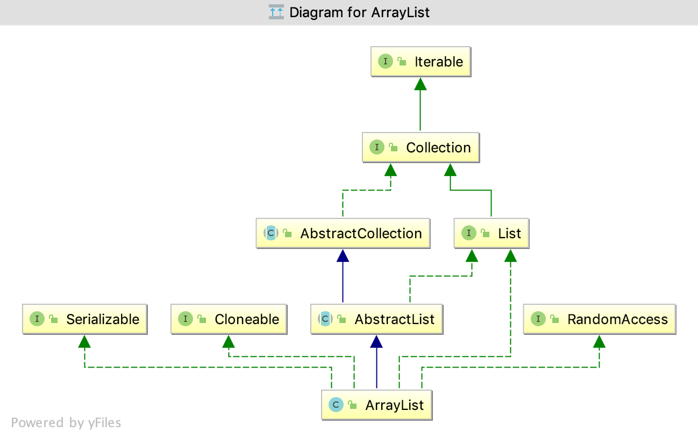
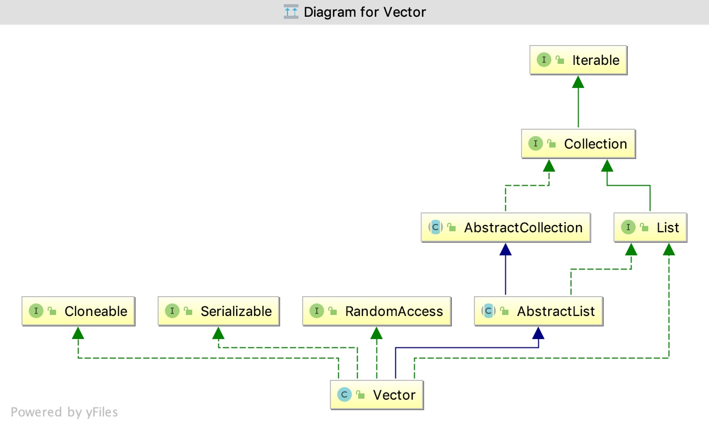
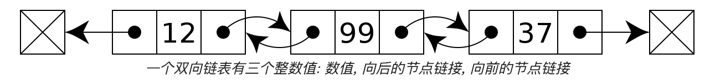
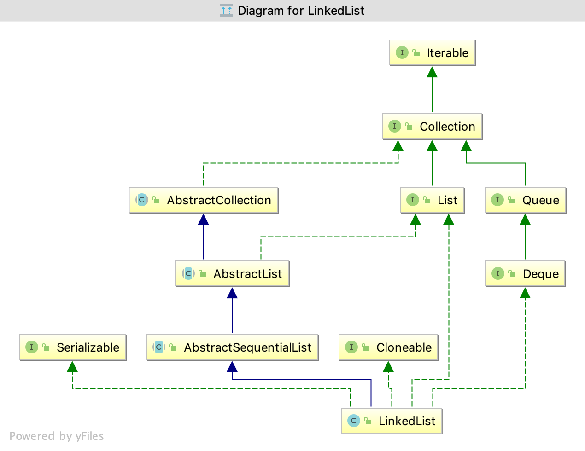

### ArrayList，Vector，LinkedList源码解析

#### ArrayList

下图是ArrayList的类图


思考一下代码执行结果如何？
```
public static void main(String[] args) {
    
    //未指定容量，指向默认空数组
    List<Integer> list1 = new ArrayList<>();
    // 正常通过，数组容量变为默认10
    list1.add(0,1);
    System.out.println(list1.get(0));

    List<Integer> list2 = new ArrayList();
    list2.set(0, 1);
    // 运行时异常
    System.out.println(list2.get(0));

}
```
为什么呢？我们先通过以下代码来看看add相关方法：

```
private static final int DEFAULT_CAPACITY = 10;

private static final Object[] DEFAULTCAPACITY_EMPTY_ELEMENTDATA = {};

transient Object[] elementData; 

private int size;

/**未指定Capacity，默认为空数组*/
public ArrayList() {
    this.elementData = DEFAULTCAPACITY_EMPTY_ELEMENTDATA;
}

/**指定初始Capacity，若Capacity大于0，则初始化为指定的大小*/
public ArrayList(int initialCapacity) {
    if (initialCapacity > 0) {
        this.elementData = new Object[initialCapacity];
    } else if (initialCapacity == 0) {
        this.elementData = EMPTY_ELEMENTDATA;
    } else {
        throw new IllegalArgumentException("Illegal Capacity: "+ initialCapacity);
    }
}

/**顺序插入*/
public boolean add(E e) {
    ensureCapacityInternal(size + 1);  // Increments modCount!!
    elementData[size++] = e;
    return true;
}

/**指定位置插入，会有数组拷贝*/
public void add(int index, E element) {
    rangeCheckForAdd(index);
    /**确认Capacity*/
    ensureCapacityInternal(size + 1);  // Increments modCount!!
    System.arraycopy(elementData, index, elementData, index + 1,
                     size - index);
    elementData[index] = element;
    size++;
}

/**指定位置add范围检查*/
private void rangeCheckForAdd(int index) {
    if (index > size || index < 0)
        throw new IndexOutOfBoundsException(outOfBoundsMsg(index));
}

```

了解了add()，add(int index, E element)方法之后，我们在熟悉一下set(int index, E element)方法

```
/**给指定index的赋值，会替换原有值，替换成功后返回原值*/
public E set(int index, E element) {
    rangeCheck(index);

    E oldValue = elementData(index);
    elementData[index] = element;
    return oldValue;
}

/**范围检查*/
private void rangeCheck(int index) {
    if (index >= size)
        throw new IndexOutOfBoundsException(outOfBoundsMsg(index));
}
```
有的小伙伴可能会说，确实add(int index, E element)，set(int index, E element)两个方法的范围检查不一样，这也只能说明add可以正常添加呀，并没有说明list1的容量变了呀，别着急，我们接着往下看。

```

/**计算容量*/
private static int calculateCapacity(Object[] elementData, int minCapacity) {
    if (elementData == DEFAULTCAPACITY_EMPTY_ELEMENTDATA) {
        return Math.max(DEFAULT_CAPACITY, minCapacity);
    }
    return minCapacity;
}

/**确定容量大小*/
private void ensureCapacityInternal(int minCapacity) {
    ensureExplicitCapacity(calculateCapacity(elementData, minCapacity));
}

/**确定容量大小*/
private void ensureExplicitCapacity(int minCapacity) {
    modCount++;

    // overflow-conscious code
    if (minCapacity - elementData.length > 0)
        grow(minCapacity);
}

/**扩大数组容量，每次扩容都会带来一次全量拷贝*/
private void grow(int minCapacity) {
    // overflow-conscious code
    int oldCapacity = elementData.length;
    /** 新容量为老容量的1.5倍*/
    int newCapacity = oldCapacity + (oldCapacity >> 1);
    /** 新容量仍小于最小需求容量时，将最小需求容量赋值给新容量*/
    if (newCapacity - minCapacity < 0)
        newCapacity = minCapacity;
    if (newCapacity - MAX_ARRAY_SIZE > 0)
        newCapacity = hugeCapacity(minCapacity);
    // minCapacity is usually close to size, so this is a win:
    /** 数组拷贝*/
    elementData = Arrays.copyOf(elementData, newCapacity);
}

/**当容量大于int最大值时，抛出OutOfMemoryError*/
private static int hugeCapacity(int minCapacity) {
    if (minCapacity < 0) // overflow
        throw new OutOfMemoryError();
    return (minCapacity > MAX_ARRAY_SIZE) ?
        Integer.MAX_VALUE :
        MAX_ARRAY_SIZE;
}
```

我们发现每次扩容都会带来一次全量的数组拷贝；所以我们想要提高ArrayList的效率就应该减少数组的扩容 ，应尽可能的指定其Capacity的大小，这也是阿里Java开发规范中所提倡的。 

其次，add()，add(int index, E element)，set(int index, E element)这三个方法的区别也应该注意；add(int index, E element) 会对现有数组从index开始拷贝，拷贝到index+1往后，共拷贝size-index个元素，然后将现有元素放置于index处;所以index的位置越靠后，需要拷贝的元素越少，效率越高；反之，index的位置越靠前，需要拷贝的元素越多，效率越低。而add()是顺序插入，在不考虑grow的情况下，是不需要拷贝的。

#### Vector

下图是Vector的类图


我们可以发现ArrayList跟Vector的类图基本一致，那么它们有什么区别呢，我们首先来看add()，add(int index, E element)方法

```
/**此构造函数支持初始化容量，指定容量扩增幅度*/
public Vector(int initialCapacity, int capacityIncrement) {
    super();
    if (initialCapacity < 0)
        throw new IllegalArgumentException("Illegal Capacity: "+
                                           initialCapacity);
    this.elementData = new Object[initialCapacity];
    this.capacityIncrement = capacityIncrement;
}

public Vector(int initialCapacity) {
    this(initialCapacity, 0);
}

/**直接默认容量是10*/
public Vector() {
    this(10);
}

/**顺序插入*/
public synchronized boolean add(E e) {
    modCount++;
    ensureCapacityHelper(elementCount + 1);
    elementData[elementCount++] = e;
    return true;
}

/**给某个index插入*/
public void add(int index, E element) {
    insertElementAt(element, index);
}

/**给某个index插入实现*/
public synchronized void insertElementAt(E obj, int index) {
    modCount++;
    if (index > elementCount) {
        throw new ArrayIndexOutOfBoundsException(index
                                                 + " > " + elementCount);
    }
    ensureCapacityHelper(elementCount + 1);
    System.arraycopy(elementData, index, elementData, index + 1, elementCount - index);
    elementData[index] = obj;
    elementCount++;
}

```

紧接着，我们了解一下Vector的get，set方法
 
```
/**获取某个index的元素*/
public synchronized E get(int index) {
    if (index >= elementCount)
        throw new ArrayIndexOutOfBoundsException(index);

    return elementData(index);
}

/**给某个index设置值*/
public synchronized E set(int index, E element) {
    if (index >= elementCount)
        throw new ArrayIndexOutOfBoundsException(index);

    E oldValue = elementData(index);
    elementData[index] = element;
    return oldValue;
}
```

最后是核心的扩容方法

```
/**确认容量*/
private void ensureCapacityHelper(int minCapacity) {
    // overflow-conscious code
    if (minCapacity - elementData.length > 0)
        grow(minCapacity);
}

/**扩容*/
private void grow(int minCapacity) {
    // overflow-conscious code
    int oldCapacity = elementData.length;
    int newCapacity = oldCapacity + ((capacityIncrement > 0) ?  capacityIncrement : oldCapacity);
    if (newCapacity - minCapacity < 0)
        newCapacity = minCapacity;
    if (newCapacity - MAX_ARRAY_SIZE > 0)
        newCapacity = hugeCapacity(minCapacity);
    /** 数组拷贝*/    
    elementData = Arrays.copyOf(elementData, newCapacity);
}

/**大容积扩容*/
private static int hugeCapacity(int minCapacity) {
    if (minCapacity < 0) // overflow
        throw new OutOfMemoryError();
    return (minCapacity > MAX_ARRAY_SIZE) ?
        Integer.MAX_VALUE :
        MAX_ARRAY_SIZE;
}
```

我们可以发现，对于核心方法的实现，除了synchronized，Vector的实现大同小异，构造函数支持扩增幅度，在未指定的情况下，扩容为原来的2倍。


#### LinkedList

在讲解LinkedList之前，我们先介绍一下双向链表的数据结构，让大家有个简要的了解。



每个节点主要有三部分构成，分别是前节点引用pre，本节点date，后节点引用next；

下图是LinkedList的类图


紧接着我们来验证LinkList的源码实现：
```
/**LinkedList中的私有静态内部类*/
private static class Node<E> {
    E item;
    Node<E> next;
    Node<E> prev;

    Node(Node<E> prev, E element, Node<E> next) {
        this.item = element;
        this.next = next;
        this.prev = prev;
    }
}

/**顺序新增*/
public boolean add(E e) {
    linkLast(e);
    return true;
}

/**新增指定位置*/
public void add(int index, E element) {
    checkPositionIndex(index);

    if (index == size)
        linkLast(element);
    else
        linkBefore(element, node(index));
}

/**检查插入位置*/
private void checkPositionIndex(int index) {
    if (!isPositionIndex(index))
        throw new IndexOutOfBoundsException(outOfBoundsMsg(index));
}

private boolean isPositionIndex(int index) {
    return index >= 0 && index <= size;
}

/**
* 拼接在last之后，如果last不存在，则表明当前是first节点；
* 否则last的next节点为新增节点
*/
void linkLast(E e) {
    final Node<E> l = last;
    final Node<E> newNode = new Node<>(l, e, null);
    last = newNode;
    if (l == null)
        first = newNode;
    else
        l.next = newNode;
    size++;
    modCount++;
}

/**
* 获取index的pre节点 temp，
* 修改index的节点的pre为 newNode
* 如果temp为空，则表明newNode为first节点
* 否则，修改temp的next为newNode，
*/
void linkBefore(E e, Node<E> succ) {
    // assert succ != null;
    final Node<E> pred = succ.prev;
    final Node<E> newNode = new Node<>(pred, e, succ);
    succ.prev = newNode;
    if (pred == null)
        first = newNode;
    else
        pred.next = newNode;
    size++;
    modCount++;
}
```
以上便是插入的流程，而删除的流程正好与插入流程相反；我们发现插入的流程只有下标的校验，并没有类似于ArrayList的扩容等操作；

我们再来看看随机访问的源码get(int index)，set(int index, E element)

```
/**随机获取某个index的元素*/
 public E get(int index) {
    checkElementIndex(index);
    return node(index).item;
}

/**随机设置某个index的元素*/
public E set(int index, E element) {
    checkElementIndex(index);
    Node<E> x = node(index);
    E oldVal = x.item;
    x.item = element;
    return oldVal;
}

/**检查元素下标*/
private void checkElementIndex(int index) {
    if (!isElementIndex(index))
        throw new IndexOutOfBoundsException(outOfBoundsMsg(index));
}

private boolean isElementIndex(int index) {
    return index >= 0 && index < size;
}

/**
* 获取某个index的节点
* 靠近前半部分就从first开始遍历
* 靠近后半部分就从last开始遍历
*/
Node<E> node(int index) {
    // assert isElementIndex(index);

    if (index < (size >> 1)) {
        Node<E> x = first;
        for (int i = 0; i < index; i++)
            x = x.next;
        return x;
    } else {
        Node<E> x = last;
        for (int i = size - 1; i > index; i--)
            x = x.prev;
        return x;
    }
}
```
你可能会惊奇的发现任意get或者set都需要调用node方法，这便会引起对node的循环；当然我们不能否定的时在顺序插入时，LinkedList的效率还是值得肯定的。

让我们总结对比一下ArrayList，Vector，LinkedList之间的异同

* Vector是同步的，线程安全的；所以在安全要求较高的情况下建议使用Vector

* 在顺序插入的情况下，ArrayList，Vector，LinkedList的性能差距不大，但是需要注意的是ArrayList，Vector如果容量设置不当，有频繁扩容的情况下，会跟LinkedList的性能有较大的差距；

* 指定位置插入时，即add(int index,E element)方法；ArrayList，Vector由于实现方式数组，所以会存在数组拷贝情况，位置越靠前，拷贝的数据量越大；而LinkedList则不存在拷贝

* 随机读取时，由于数组存储是连续的array[index]即可获取，而LinkedList则需要根据位置来遍历，所以性能差于数组集合。

* 所以随机读取比较频繁的场景下建议使用ArrayList，并分配其合适的容量；


