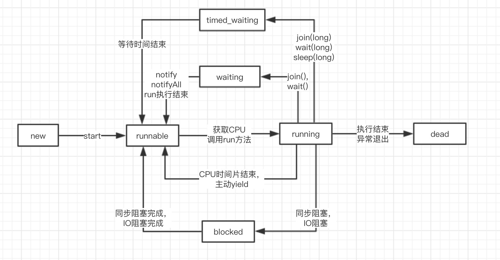

### 并发编程

在并发编程中，有两个基本的概念：进程、线程；在java语言中，并发编程的核心是线程，当然进程也很重要。

#### 进程与线程

进程可以理解为程序的一个实例，进程是操作系统进行资源分配和调度的最小单位。
而线程则是程序执行的最小单位；一个运行中的程序对应一个进程，而一个进程有若干个线程组成。

#### 并行与并发

并行是指同一个操作系统同时运行多个进程（例如：你的个人PC上同时运行着QQ与微信），而并发则是指一个程序同时执行者多个线程一起执行；它们所特指的主体是不一样的，并行指操作系统维度的，而并发则是指程序或者进程维度的。

#### 线程安全与非线程安全

线程安全是多线程并发编程时的一个概念；在数据共享拥有多个线程并发执行的程序中，通过同步机制保证各个线程之间能够正常且正确的执行，不会无线数据污染的情况，那么它就是线程安全的。

非线程安全则是会出现执行异常，或者数据污染的情况。

#### 线程池

顾名思义，就是将线程资源池化，因为频繁的创建以及销毁线程会对系统资源有较大的消耗，我们可以通过创建一个线程资源池的方式，避免了短时间内创建和销毁线程的代价，提高了系统内核的使用率。

#### 定义与启动一个线程

我们先通过以下例子了解如何定义并启动线程：
```
/**
 * 方式一
 */
public class ThreadDemo extends Thread {

    @Override
    public void run() {
        System.out.println("start demo 1");
    }

    public static void main(String[] args) {
        new ThreadDemo().start();
    }
}

/**
 * 方式二
 */
public class ThreadRunnable implements Runnable {

    @Override
    public void run() {
        System.out.println("start demo 2");
    }

    public static void main(String[] args) {
        new Thread(new ThreadRunnable()).start();
    }
}
```

#### 线程状态的转换




状态描述：

1.new Thread()，线程创建之后进入new状态

2.当线程对象调用start()方法之后，线程进入Runnable状态

3.当线程获取CPU时间片，线程进入Running状态

4.线程正常执行完，或者异常退出，线程销毁接入Dead（TERMINATED）状态

5.Running的线程调用yield()方法，主动让出CPU，重新回到Runnable状态

6.Running的线程调用join(),或者Object.wait()方法，线程进入到Waiting状态

7.Running的线程调用Thread.sleep(long ms),join(long ms)或者Object.wait(long ms)方法，线程进入到Timed_waiting状态

8.Running的线程，遇到同步阻塞或者IO阻塞，线程进入到Blocked状态;阻塞结束后会重新进入到Runnable状态


各个状态测试：
```
public class ThreadStatDemo {

    public static void main(String[] args) {
        block();
    }

    /**
     * Runnable状态
     */
    private static void runnable() {
        int i = 0;
        while (true) {
            i++;
            if (i == 10) {
                i = 0;
            }
        }
    }

    /**
     * WAITING 状态
     */
    private static void waiting() {
        Object lock = new Object();
        synchronized (lock) {
            try {
                lock.wait();
            } catch (InterruptedException e) {
                e.printStackTrace();
            } finally {
            }
        }

    }

    /**
     * TIMED_WAITING 状态
     */
    private static void timedWaiting() {
        Object lock = new Object();
        synchronized (lock) {
            try {
                lock.wait(100000L);
            } catch (InterruptedException e) {
                e.printStackTrace();
            } finally {
            }
        }
    }

    /**
     * BLOCKED 状态
     */
    private static void block() {
        final Object lock = new Object();
        new Thread() {
            @Override
            public void run() {
                synchronized (lock) {
                    try {
                        Thread.sleep(1000L * 1000);
                    } catch (InterruptedException e) {
                    }
                }
            }
        }.start();

        try {
            Thread.sleep(100);
        } catch (InterruptedException e) {
        }

        synchronized (lock) {
            try {
                Thread.sleep(30 * 1000);
            } catch (InterruptedException e) {
            }
        }
    }
}
```


#### 死锁
死锁就是指多线程之间竞争资源进而各个进程都进入阻塞状态，导致程序无法正常运行的一种僵局。

在这里我们举一个通俗易懂的例子，有两个员工被分别指派了一个任务，员工一完成任务需要用到资源A，资源B；而员工二完成任务需要用到资源B，资源A；在这种情况下，员工一和员工二极容易由于资源竞争产生造成相互等待，进而导致死锁。

以下是程序实现演示：
```
public class DeadLock {

    final static Object RESOURCE_A = new Object();
    final static Object RESOURCE_B = new Object();

    static class TroubleMaker {

        private String name;

        public TroubleMaker(String name) {
            this.name = name;
        }

        public String getName() {
            return name;
        }

        public void setName(String name) {
            this.name = name;
        }

        public synchronized void jobA() {
            synchronized (RESOURCE_A) {
                System.out.println(this.name + " get RESOURCE_A");
                try {
                    Thread.sleep(500L);
                } catch (InterruptedException e) {
                    e.printStackTrace();
                }
                System.out.println(this.name + " wait RESOURCE_B...");
                synchronized (RESOURCE_B) {
                    System.out.println(this.name + " get RESOURCE_B");
                }
            }


        }

        public synchronized void jobB() {
            synchronized (RESOURCE_B) {
                System.out.println(this.name + " get RESOURCE_B");
                try {
                    Thread.sleep(500L);
                } catch (InterruptedException e) {
                    e.printStackTrace();
                }
                System.out.println(this.name + " wait RESOURCE_A...");
                synchronized (RESOURCE_A) {
                    System.out.println(this.name + " get RESOURCE_A");
                }
            }

        }


    }

    public static void main(String[] args) {
        TroubleMaker ade = new TroubleMaker("Ade");
        TroubleMaker peh = new TroubleMaker("Peh");
        new Thread(new Runnable() {
            @Override
            public void run() {
                ade.jobA();
            }
        }).start();

        new Thread(new Runnable() {
            @Override
            public void run() {
                peh.jobB();
            }
        }).start();
    }

}
```

#### 简易线程池实现

```
package xin.sunce.base.chapter8;

import java.util.List;
import java.util.Vector;
import java.util.concurrent.BlockingDeque;
import java.util.concurrent.LinkedBlockingDeque;

/**
 * 线程池示例
 */
public class SelfThreadExecutors {
    
    //工作线程集合
    private List<Worker> workers;

    //待处理任务集合
    private BlockingDeque<Runnable> jobs;
    
    //线程总大小
    private int coreSize = 0;
    
    //活跃线程数
    private int activeSize = 0;
    
    //运行状态
    private volatile boolean flag = true;

    private SelfThreadExecutors() {

    }

    //构造函数，初始化任务队列，以及工作线程
    public SelfThreadExecutors(int coreSize) {
        if (coreSize <= 1) {
            throw new RuntimeException(String.format("wrong core size:%d", coreSize));
        }
        this.coreSize = coreSize;
        this.workers = new Vector<>(coreSize);
        this.jobs = new LinkedBlockingDeque<>();
    }

    
    //执行任务，活跃数小于总线程数时新建，否则直接将任务加入队列
    public void start(Runnable runnable) {
        if (activeSize < coreSize) {
            addThread(runnable);
        } else {
            jobs.add(runnable);
        }
    }

    //新建线程
    public void addThread(Runnable runnable) {
        activeSize++;
        jobs.add(runnable);
        Worker worker = new Worker();
        workers.add(worker);
        worker.start();
    }


    //工作线程内部类
    class Worker extends Thread {

        @Override
        public void run() {
            while (true && flag) {
                Runnable job = getJob();
                if (null != job) {
                    System.out.println(Thread.currentThread().getName());
                    job.run();
                }
            }
        }


    }
    
    //获取任务
    private Runnable getJob() {
        try {
            return jobs.take();
        } catch (InterruptedException e) {
            e.printStackTrace();
            return null;
        }
    }
    
    //测试main方法
    public static void main(String[] args) {
        SelfThreadExecutors executors = new SelfThreadExecutors(4);
        for (int i = 0; i < 100; i++) {
            final int j = i;
            executors.start(() -> System.out.println("工作内容" + j));

        }
    }

}

```