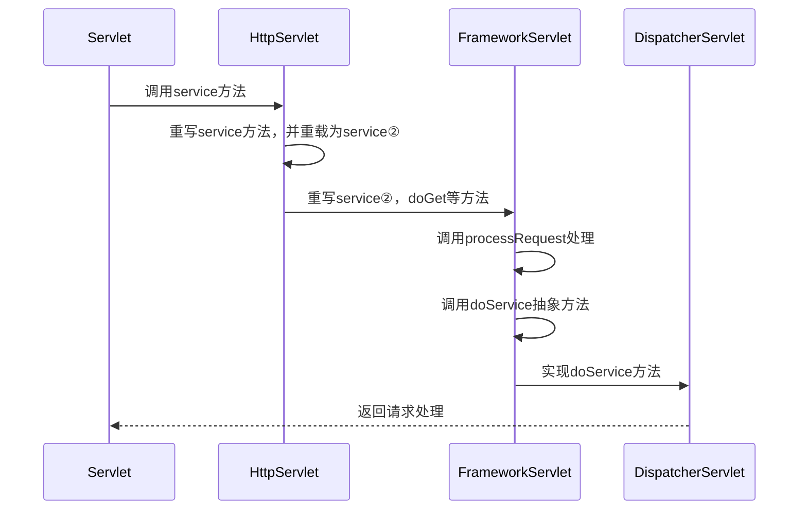

#### MVC简介

       我们开门见山，首先要明确MVC是一种设计思想，它的目的是明确各个模块之间自己的职责，
    进而达成解耦的效果，M代表着Model层，顾名思义这一层包含着各种各样的模型，例如数据模
    型，业务模型等等，我们通常开发的Service属于这一层；V代表是View层，这一层是视图层，
    即渲染展现给用户的各种页面，View；而C则代表着Controller层，这一层是Model跟View
    层之间的桥梁，它将请求转发给对应的Model，并将Model层处理的结果返回给View层。
        
        
#### MVC实现

       只要一提到MVC，人们往往就会脱口而出SpringMVC；但是MVC跟SpringMVC还是有区别的，
    MVC是一种设计思想；而SpringMVC是一个被我们熟知且广泛使用的一个实现MVC的框架；还有
    一个常用的MVC框架你可能也耳熟能详Struts；Struts较SpringMVC出现较早，起初有较大的
    市场份额，但随着SpringMVC的横空出世以及时间的推移，Struts的份额逐年减少，SpringMVC
    的份额则遥遥领先；本文将着重针对SpringMVC进行介绍。
      
#### SpringMVC

       了解的MVC的前世今生，我们开始了解SpringMVC，在SpringMVC中有一个核心便是
    DispatcherServlet，如果一个人的简历是写着熟悉SpringMVC，而对于DispatcherServlet
    一问三不知，那么这个人显然是不合格的。以下是DispatcherServlet的类图。
       


        了解清楚类图以后，我这里提出一些问题大家思考一下，你了解Servlet的生命周期么？
    Servlet跟DispatcherServlet有什么关系？又有什么区别？
        

首先，我们来了解Servlet的生命周期，先看看Servlet的代码:
```
public interface Servlet {

    void init(ServletConfig var1) throws ServletException;
    
    .....
    
    void service(ServletRequest var1, ServletResponse var2) throws ServletException, IOException;

    .....

    void destroy();
}

```

#### Servlet的生命周期

    0.首先创建Servlet实例

    1.其次调用Servlet.init()，完成初始化，在一个Servlet的生命周期中init方法只会
    被执行一次，无论用户执行多少请求，都不会再次调用init方法；

    2.业务的实际处理是Servlet.service()执行的；所以每一次请求的处理，最终都会有
    service方法执行处理，所以这个方法可以被多次调用；

    3.Servlet对象的销毁时调用Servlet.destroy()方法，同样的这个方法也只会被调用一次。

    而HttpServlet是Servlet的一个实现，在调用service方法时，会根据具体的请求类型，
    调用具体的protected方法，doGet，doPost，doHead等。
    
    
#### 开端

       回顾DispatcherServlet的类图，我们知道HttpServlet是其超类（父类），所以它的
    生命周期跟Servlet一致，那么我们一起看看DispatcherServlet的核心service方法。
       
如下：

        
        我们在DispatcherServlet并没有找到service方法，而是找到一个doService方法，
     我们在DispatcherServlet的父类FrameworkServlet中找到了service方法的实现，
     代码片段如下：
   
```
protected void service(HttpServletRequest request, HttpServletResponse response) throws ServletException, IOException {
        HttpMethod httpMethod = HttpMethod.resolve(request.getMethod());
        if (HttpMethod.PATCH != httpMethod && httpMethod != null) {
            super.service(request, response);
        } else {
            this.processRequest(request, response);
        }

    }
    
protected final void doGet(HttpServletRequest request, HttpServletResponse response) throws ServletException, IOException {
    this.processRequest(request, response);
}

protected final void doPost(HttpServletRequest request, HttpServletResponse response) throws ServletException, IOException {
    this.processRequest(request, response);
 }
    
..... 省略部分代码
protected final void processRequest(HttpServletRequest request, HttpServletResponse response) throws ServletException, IOException {
    .....
    this.doService(request, response);
    .....
}

..... 省略部分代码

protected abstract void doService(HttpServletRequest var1, HttpServletResponse var2) throws Exception;

    
```
   
        在FrameworkServlet的service方法中，在HttpMethod不等于PATCH且不等于空
     的情况下调用了父类的Service方法，而父类的Service方法又会根据请求类型调用具体
     的doGet或者doPost等方法，FrameworkServlet的doGet等方法会将请求送到
     processRequest方法中，所以FrameworkServlet及其子类请求都在processRequest
     处理，该方法在处理时会调用冲向方法doService，所以DispatcherServlet处理的核心
     便是我们之前看到的doService方法；
        
        细心的你，也许会指出service方法的请求参数变成HttpServletRequest，
     HttpServletResponse而不是ServletRequest，ServletResponse；原因是
     HttpServlet在实现service方式时，对service方法进行了重写，代码细节如下：
        
        
```
public void service(ServletRequest req, ServletResponse res) throws ServletException, IOException {
        HttpServletRequest request;
        HttpServletResponse response;
        try {
            request = (HttpServletRequest)req;
            response = (HttpServletResponse)res;
        } catch (ClassCastException var6) {
            throw new ServletException("non-HTTP request or response");
        }

        this.service(request, response);
    }
```
**重写后的方法的参数，便成为了HttpServletXX，而FrameworkServlet又继承自
HttpServlet的子类HttpServletBean，所以直到DispatcherServlet这一子类，
以下是一张时序图帮你梳理这个过程**



#### 揭开doService的神秘面纱
```
private List<HandlerMapping> handlerMappings;
private List<HandlerAdapter> handlerAdapters;
private List<HandlerExceptionResolver> handlerExceptionResolvers;
private List<ViewResolver> viewResolvers;

/**
* Spring容器初始化Bean时会调用
*/
protected void onRefresh(ApplicationContext context) {
    this.initStrategies(context);
}

/***
* 初始化handlerMappings，handlerAdapters，viewResolvers等
*/
protected void initStrategies(ApplicationContext context) {
    this.initMultipartResolver(context);
    this.initLocaleResolver(context);
    this.initThemeResolver(context);
    this.initHandlerMappings(context);
    this.initHandlerAdapters(context);
    this.initHandlerExceptionResolvers(context);
    this.initRequestToViewNameTranslator(context);
    this.initViewResolvers(context);
    this.initFlashMapManager(context);
}

protected void doService(HttpServletRequest request, HttpServletResponse response) throws Exception {
    .....
    this.doDispatch(request, response);
    .....
}

.....

protected void doDispatch(HttpServletRequest request, HttpServletResponse response) throws Exception {
    HandlerExecutionChain mappedHandler = null;
    ...
    ModelAndView mv = null;
    ...
    mappedHandler = this.getHandler(processedRequest);
    ...
    HandlerAdapter ha=this.getHandlerAdapter(mappedHandler.getHandler());
    ...
    mv = ha.handle(processedRequest,response,mappedHandler.getHandler());
    ...
    this.processDispatchResult(processedRequest, response, 
    mappedHandler, mv, (Exception)dispatchException);
}

```
**doService方法调用doDispatch方法，在doDispatch方法中获取Handler，
在根据Handler获取对应的HandlerAdpter实例ha，然后ha调用handle方法处
理请求，并返回ModelAndView实例mv,随后调用processDispatchResult处理
dispatch结果。**


